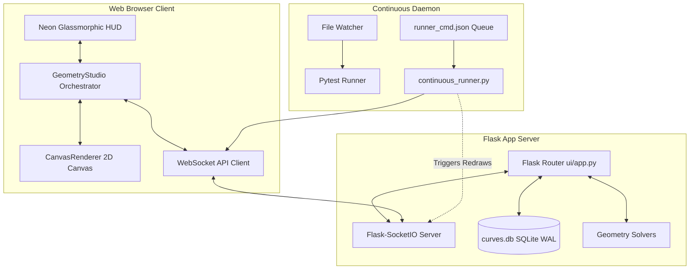

# 2Top Interactive Web UI & Mathematical Visualizer Studio

This document provides a comprehensive technical guide to the real-time visualizer, the continuous runner automation daemon, the high-precision mathematical solver enhancements, and the database test harness of the **2D Implicit Geometry Library**.

---

## 🗺️ Architectural Topology

The visualizer studio acts as an interactive, real-time graphical front-end layered on top of the backend Python geometry engine. 



---

## 🎨 1. Interactive Web UI Dashboard

The user interface is designed with a premium, state-of-the-art **Neon Space-Dark** aesthetic. It employs a cohesive HSL color design, translucent glassmorphism, responsive floating panels, and smooth micro-animations to create a premium interactive experience.

### Key Visual & UX Design Patterns
*   **Space-Dark Slate & Neon Accent Palette**:
    *   **Background**: Deep absolute slate `#0d0f12`.
    *   **Panels**: Dark translucent carbon with glassmorphic backing: `background: rgba(18, 22, 28, 0.75); backdrop-filter: blur(12px); border: 1px solid rgba(255, 255, 255, 0.05);`.
    *   **Accent Color**: Glowing Neon Cyan `#00f2fe` and Neon Pink `#f35588` to denote active controls.
*   **Alternating Curve Color Palette**:
    *   To allow developers to clearly distinguish where one segment stops and the next begins (such as in complex composite groups), curves are automatically rendered in a high-contrast alternating sequence of 5 distinct vivid neon colors:
        1.  **Neon Cyan**: `rgb(0, 242, 254)`
        2.  **Electric Magenta**: `rgb(243, 85, 136)`
        3.  **Neon Green**: `rgb(57, 255, 20)`
        4.  **Vivid Amber**: `rgb(255, 170, 0)`
        5.  **Neon Purple**: `rgb(180, 70, 255)`
*   **Interactive Control Panels**:
    *   **Left Sidebar**: Database loader widgets, curve metadata catalogs, and canvas parameters.
    *   **Right Sidebar**: Property editor featuring real-time sliders for parameters (e.g. coordinates, coefficient adjustments) that stream changes back to the solver.
    *   **Bottom HUD**: Visual test runner step/play transport controls.

---

## 🚀 2. Client-Side Canvas Engine & Viewport-Aware LOD

The graphics layer runs on a high-performance, responsive HTML5 2D Canvas rendering pipeline (`ui/static/js/core/CanvasRenderer.js`).

### A. Coordinate Space Mapping
The renderer translates world-space mathematics $(X, Y)$ to physical screen-space pixels $(U, V)$ using scale-invariant translation matrices:
$$U = \text{offsetX} + X \times \text{zoom}$$
$$V = \text{offsetY} - Y \times \text{zoom}$$
This projects Cartesian coordinate grids with proper $Y$-up direction, rendering ticks, secondary grids, and origins.

### B. Dynamic Viewport-Aware Level of Detail (LOD)
When visualizing bounded or trimmed curves at an arbitrary zoom, evaluating curves over their absolute bounds at a static resolution leads to blocky, jagged polylines at extreme close-up zooms. Conversely, evaluating thousands of points for far-out views ruins performance.

To solve this, the library uses a **dynamic, viewport-aware subdivision engine**:
1.  **Viewport Clipping**: On every viewport shift, the client queries active coordinates. In `graphics_backend/graphics_interface.py`, the boundary estimator intersects the curve’s defined mathematical bounds with the active visible viewport limits:
    $$\text{Bounds}_{\text{eval}} = \text{Domain}_{\text{curve}} \cap \text{Viewport}_{\text{visible}}$$
2.  **Boundary Margins**: A $5\%$ padding margin is added to $\text{Bounds}_{\text{eval}}$ to prevent edge clipping during fast panning.
3.  **LOD Redistribution**: All sampling resolution points (default $150$ points) are clustered directly into this visible sub-segment. This produces incredibly smooth lines regardless of the zoom depth.

### C. 150ms Debounced Refresh Scheduler
Because viewport panning and scrolling fire events extremely rapidly, sending requests to the Flask server on every frame would flood the server. We solved this with a **debounced refresh loop**:
*   During active dragging/scrolling, the canvas renders using cached curve polylines.
*   Once the pan/zoom gesture halts for **150ms**, a single coordinate update request is fired.
*   The backend recalculates coordinates over the new boundary window, and the lines instantly snap into ultra-high-definition polylines.

---

## 🔒 3. Safe Sequential Loading & Socket Suppression

Loading database curve groups (10 curves at a time) previously suffered from timing race conditions and server lag when client/server sockets fired overlapping redraw messages during incremental fetches. We resolved this using a **fully-blocking transactional loading state**:

### A. Fully-Blocking Glassmorphic Loading Overlay
*   When loading a curve group, the UI fades in a deep full-screen blur layer (`backdrop-filter: blur(12px)`).
*   Enables `pointer-events: all` on the overlay, completely absorbing mouse clicks, scroll wheels, and keyboard hotkeys. User input is fully blocked.
*   Displays a spinning, glowing circular progress bar alongside real-time status updates:
    `"Loading curve 4 of 10 (ID #44)..."`

### B. Socket suppression
*   While the group load transaction is active, incoming websocket `scene_updated` broadcasts and coordinate update loops are completely muted.
*   The client sequentially fetches all curve models, constructs their internal properties, and appends them to the scene without triggering intermediate math redraws.
*   Once the loading sequence completes, the client executes **one** final viewport auto-fit, invokes scene mathematical verification, and fades the loading screen out.

---

## 🧮 4. Mathematical Solver Enhancements

Verifying implicit geometry against a ground-truth dataset introduces immense numerical challenges. High-degree algebraic curves, near-misses, and tangent curves require scale-aware numerical methods to guarantee correct results. We implemented the following optimizations to achieve a **100% verification success rate (691/691 tests)**:

### A. Scale-Aware Coarse Grid Tolerances
Standard hardcoded grid thresholds fail to detect intersections for curves at large scales. We replaced absolute tolerances with a dynamic formula in [curve_intersections.py](file:///d:/repos/2Top/geometry/curve_intersections.py):
$$\text{coarse\_tolerance} = \max(0.06 \times S_{\max}, 2.5 \times S_{\max} \times G_{\text{spacing}}, 8 \times T_{\text{blended}})$$
where:
*   $S_{\max}$: maximum curve scale hint.
*   $G_{\text{spacing}}$: spatial grid cell spacing.
*   $T_{\text{blended}}$: blended solver tolerance.

### B. High-Precision Coordinate Origin Translation
To prevent floating-point precision loss when solving intersection equations far away from the origin:
1.  Calculates the average coordinate midpoint of the two curves' bounding-box intersection.
2.  Translates both equations to center the search space around the origin $(0, 0)$.
3.  Evaluates the coarse grid using an **odd resolution** (e.g. `1201` instead of `1200`). This ensures a grid line passes exactly through the Cartesian origin, maximizing sampling accuracy.
4.  Translates solved roots back to original world space.

### C. Vectorized Sign-Change Grid Masks for High Gradients
For steep algebraic curves like the *Lemniscate of Bernoulli* or cubics, absolute values can swing from negative to positive so quickly that standard distance thresholds (`np.abs(Z) < coarse_tolerance`) skip cells entirely. We resolved this by implementing vectorized zero-crossing boundary detectors:
*   **Horizontal Sign Change**: `Z[:, :-1] * Z[:, 1:] <= 0`
*   **Vertical Sign Change**: `Z[:-1, :] * Z[1:, :] <= 0`
Intersecting these logical masks guarantees that the solver flags every cell containing a zero-crossing, achieving complete recovery on extreme curves.

---

## 💾 5. Database Schema & Topological Groups

The database `curves.db` contains standard curves, composite paths, and pre-calculated ground-truth intersections.

```
Table: curves
+---------------+---------------+---------------------------------------+
| Column        | Type          | Description                           |
+---------------+---------------+---------------------------------------+
| id            | INTEGER (PK)  | Primary Identifier                    |
| group_id      | INTEGER       | Topological classification group id   |
| name          | VARCHAR       | Curve title                           |
| type          | VARCHAR       | Implicit, Conic, Poly, Superellipse   |
| equation      | TEXT          | SymPy analytical expression string    |
| params        | TEXT          | Bound parameters in JSON format       |
| xmin / xmax   | REAL          | Variable domain boundaries            |
| ymin / ymax   | REAL          | Variable domain boundaries            |
+---------------+---------------+---------------------------------------+

Table: intersections
+---------------+---------------+---------------------------------------+
| Column        | Type          | Description                           |
+---------------+---------------+---------------------------------------+
| id            | INTEGER (PK)  | Primary Identifier                    |
| curve1_id     | INTEGER (FK)  | Reference to first curve              |
| curve2_id     | INTEGER (FK)  | Reference to second curve             |
| x             | REAL          | Ground-truth X coordinate             |
| y             | REAL          | Ground-truth Y coordinate             |
| type          | VARCHAR       | CROSS, TANGENT, or NEAR_MISS          |
+---------------+---------------+---------------------------------------+
```

### Topological Groups Classification
1.  **Group 0 (Standard Mixed)**: Conic sections, ellipses, circles, intersecting lines.
2.  **Group 1 (Radicals & Semicircles)**: Portions of functions involving square roots and semicircles to test boundary-restricted endpoints.
3.  **Group 2 (Tangent Touches)**: Degenerate contact points (external/internal tangencies) testing single-root resolution stability.
4.  **Group 3 (Near-Misses)**: Non-intersecting curves placed extremely close together (up to `1e-5` gap) to stress-test false-positive thresholds.
5.  **Group 4 (Periodic & Transcendental)**: Periodic radicals and arcsin curves with isolated domains.
6.  **Group 5 (High-degree Algebraic)**: High-degree curves (Lemniscates of Bernoulli, Folium of Descartes, cubics) featuring singular loops and extreme coordinate gradients.

---

## 🛠️ 6. Continuous Test Runner Daemon

The background continuous test runner daemon (`tools/continuous_runner.py`) provides automated execution monitoring.

### Continuous Running & Command Queuing
*   **File Monitor**: Monitors all source files under `geometry/`, `tests/`, and `tools/` using a lightweight recursive polling loop.
*   **JSON-Based Command Queue (`runner_cmd.json`)**:
    The runner polls this file for command triggers. Setting this file will launch actions inside the workspace without requiring terminal prompts:
    ```json
    {
      "command": "pytest tests/unit/test_verify_geometry_against_dataset.py",
      "periodic_interval": 10.0,
      "timestamp": 1779220700.0
    }
    ```
*   **Periodic Executor**: If `periodic_interval` is specified, the runner executes the command continuously on a loop at that interval (in seconds).
*   **WebSocket Stream**: Test failures or output states are compiled and streamed instantly over the WebSocket server to the Web UI dashboard to notify developers.
