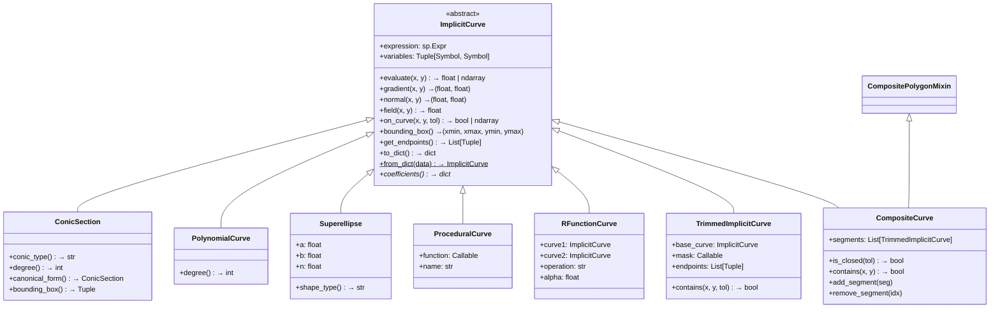

# 2Top Engine — Architecture Overview

> **Purpose**: This document provides a comprehensive inventory of every module, class, public method, data flow, and design pattern in the 2Top 2D implicit geometry engine.  It is intended as input to a planning AI that will design the **Semantic Anchor Framework** on top of this foundation.

---

## 1. High-Level Package Map

```
2Top/
├── geometry/                 # Core implicit-math library (the engine)
│   ├── implicit_curve.py     # Abstract base class for all curves
│   ├── conic_section.py      # Degree-2 curves (circles, ellipses, hyperbolas, parabolas)
│   ├── polynomial_curve.py   # Arbitrary-degree polynomial curves
│   ├── superellipse.py       # |x/a|^n + |y/b|^n = 1 family
│   ├── procedural_curve.py   # User-defined Python callable curves
│   ├── rfunction_curve.py    # Constructive geometry (union, intersect, difference, blend)
│   ├── trimmed_implicit_curve.py  # Masked segments of base curves
│   ├── composite_curve.py    # Ordered sequence of trimmed segments
│   ├── area_region.py        # Filled 2D regions with outer boundary + holes
│   ├── base_field.py         # Scalar field abstraction (CurveField, BlendedField)
│   ├── field_strategy.py     # Strategy pattern for field generation from regions
│   ├── precision.py          # Global PrecisionPolicy (tolerance knobs)
│   ├── parameter_interface.py # ParameterInterface / ParameterMixin for animation
│   ├── polygon_mixin.py      # CompositePolygonMixin for convex polygon metadata
│   ├── curve_intersections.py # Grid → refine intersection finder
│   ├── factories.py          # High-level shape factories (polygon, square, circle, ...)
│   ├── reliable_factories.py # Parametric-segment factories (heart, egg, D-shape, ...)
│   ├── parametric_segment.py # Parametric segment helpers for reliable_factories
│   └── __init__.py           # Public exports
│
├── scene_management/
│   └── scene_manager.py      # SceneManager: named objects, styles, groups,
│                             #   dependencies, parameter animation, persistence
│
├── graphics_backend/
│   ├── graphics_interface.py  # GraphicsBackendInterface: rendering, data extraction
│   └── mcp_handler.py         # MCPCommandHandler: structured command API for agents
│
├── ui/                        # Flask web-based interactive visualizer studio
│   ├── app.py                 # Main Flask application
│   ├── static/                # JS/CSS assets
│   └── templates/             # HTML templates
│
├── visual_tests/              # Visual regression test infrastructure
│   ├── utils/                 # Test object factories (RegionFactory, CurveFactory)
│   └── ...
│
├── tests/                     # Pytest test suite (865+ tests)
│   ├── unit/                  # Unit tests
│   ├── property/              # Property-based / fuzz tests
│   ├── golden/                # Golden digest comparison
│   └── ...
│
└── design_docs/               # Historical design specifications
```

---

## 2. Core Geometry Layer — `geometry/`

### 2.1 Class Hierarchy



### 2.2 `ImplicitCurve` — The Abstract Base

**File**: [implicit_curve.py](file:///d:/repos/2Top/geometry/implicit_curve.py)

The root class for every curve in the system.  All curves are defined by an implicit equation **f(x, y) = 0**.

| Method | Signature | Description |
|---|---|---|
| `evaluate` | `(x, y) → float \| ndarray` | Evaluate f(x,y). **Negative inside**, positive outside for closed curves. Supports scalar and numpy array inputs. |
| `gradient` | `(x, y) → (grad_x, grad_y)` | Symbolic differentiation → lambdified. Returns outward normal direction on the curve. |
| `normal` | `(x, y) → (nx, ny)` | Unit normal at a point (raises `ValueError` if gradient magnitude is zero). |
| `field` | `(x, y) → float` | Alias for `evaluate()` — emphasizes scalar-field interpretation. |
| `on_curve` | `(x, y, tolerance?) → bool \| ndarray` | `|f(x,y)| ≤ tol`. Uses `PrecisionPolicy.blended_tolerance()`. |
| `bounding_box` | `() → (xmin, xmax, ymin, ymax)` | Default returns `(-1000, 1000, -1000, 1000)`. Subclasses override with tighter bounds. |
| `get_endpoints` | `(xmin?, xmax?) → List[Tuple]` | Dynamically finds periodic zero-crossings for trig-based curves. |
| `to_dict` / `from_dict` | Serialization | Round-trip JSON-compatible dict. `from_dict` dispatches to correct subclass via `type` field. |
| `coefficients` | `() → dict` | **Abstract** — subclasses must implement. |
| `precision_policy` | `() → PrecisionPolicy` | Returns the policy controlling all tolerance decisions for this curve. |
| `scale_hint` | `() → float` | Returns a characteristic scale (default 1.0). Subclasses provide tighter estimates. |

**Key implementation detail**: `evaluate()` lazily creates a `sp.lambdify` function on first call and caches it in `_eval_func`, giving C-level performance on subsequent calls.

### 2.3 Curve Subclasses

#### `ConicSection` — [conic_section.py](file:///d:/repos/2Top/geometry/conic_section.py)

Degree-2 implicit curves: `Ax² + Bxy + Cy² + Dx + Ey + F = 0`.

| Method | Description |
|---|---|
| `conic_type()` | Returns `"circle"`, `"ellipse"`, `"parabola"`, `"hyperbola"`, or `"degenerate"` using discriminant B²−4AC. |
| `bounding_box()` | Exact bounds for circles/ellipses (center ± semi-axis). Conservative for parabolas/hyperbolas. |
| `_extract_coefficients()` | Extracts A–F via `sp.expand().coeff()`. Cached. |

#### `PolynomialCurve` — [polynomial_curve.py](file:///d:/repos/2Top/geometry/polynomial_curve.py)

General polynomial `P(x,y) = 0` of arbitrary degree.

| Method | Description |
|---|---|
| `degree()` | Total degree via `sp.poly().total_degree()`. Cached. |
| `coefficients()` | Returns `Poly.as_dict()`. |

#### `Superellipse` — [superellipse.py](file:///d:/repos/2Top/geometry/superellipse.py)

Curves of the form `|x/a|^n + |y/b|^n - 1 = 0`.

| Parameter | Description |
|---|---|
| `a`, `b` | Semi-axis lengths |
| `n` | Shape exponent (1 = diamond, 2 = ellipse, >2 = square-like) |

| Method | Description |
|---|---|
| `shape_type()` | Returns `"diamond"`, `"circle"`, `"ellipse"`, `"square-like"`, or `"rounded-diamond"`. |
| `gradient()` | Piecewise analytical gradient with singularity handling at axes. |

#### `ProceduralCurve` — [procedural_curve.py](file:///d:/repos/2Top/geometry/procedural_curve.py)

Wraps an arbitrary Python callable `f(x, y) → float` as an `ImplicitCurve`. **No symbolic expression** (`expression = None`).

| Characteristic | Detail |
|---|---|
| Gradient | Numerical (central finite differences, h = 1e-8) |
| Serialization | Stores `"function": "custom"` placeholder; **cannot reconstruct** the callable from JSON. |
| Vectorization | Tries direct numpy call; falls back to `np.vectorize`. |

#### `RFunctionCurve` — [rfunction_curve.py](file:///d:/repos/2Top/geometry/rfunction_curve.py)

Constructive Solid Geometry (CSG) via R-functions. Combines two child `ImplicitCurve` objects.

| Operation | Formula | Description |
|---|---|---|
| `union` | `min(f1, f2)` | Inside if inside **either** curve |
| `intersection` | `max(f1, f2)` | Inside only in **overlap** |
| `difference` | `max(f1, -f2)` | A \ B |
| `blend(alpha)` | `(f1+f2-√((f1-f2)²+α²))/2` | Smooth union with configurable roundness |

**Convenience wrappers**: `union()`, `intersect()`, `difference()`, `blend()` top-level functions in [__init__.py](file:///d:/repos/2Top/geometry/__init__.py).

### 2.4 Trimming and Composition

#### `TrimmedImplicitCurve` — [trimmed_implicit_curve.py](file:///d:/repos/2Top/geometry/trimmed_implicit_curve.py)

A **segment** of a base curve, restricted by a boolean mask function `mask(x, y) → bool`.

| Attribute | Description |
|---|---|
| `base_curve` | The underlying `ImplicitCurve` being trimmed |
| `mask` | Callable `(x, y) → bool` defining the included region |
| `endpoints` | Optional `List[(x,y)]` — the segment's start/end points |
| `_xmin, _xmax, _ymin, _ymax` | Optional explicit bounding box for fast spatial filtering |

| Method | Description |
|---|---|
| `contains(x, y, tol)` | True if point is on the base curve **and** passes the mask. |
| `evaluate(x, y)` | Delegates to `base_curve.evaluate()`. |
| `bounding_box()` | Returns explicit bounds if set, else base curve's bounds. |

> [!IMPORTANT]
> **For the Semantic Anchor Framework**: `TrimmedImplicitCurve` is the exact analog of a "Segment" in the semantic model. Endpoints correspond to Anchors, and the mask defines the non-destructive trim.

#### `CompositeCurve` — [composite_curve.py](file:///d:/repos/2Top/geometry/composite_curve.py)

An ordered sequence of `TrimmedImplicitCurve` segments forming a piecewise path.

| Attribute | Description |
|---|---|
| `segments` | `List[TrimmedImplicitCurve]` — ordered list of segments |

| Method | Signature | Description |
|---|---|---|
| `is_closed` | `(tol?) → bool` | Checks if last segment's endpoint connects to first segment's start within tolerance. Supports both explicit endpoint verification and numerical/sampling fallback. |
| `contains` | `(x, y, region_containment?) → bool` | Boundary test (on any segment) or region containment (ray-casting on polygonal approximation). |
| `evaluate` | `(x, y) → float \| ndarray` | Pseudo-distance: minimum distance to any segment. Special fast-path for squares and convex polygons. |
| `add_segment` | `(seg)` | Append a segment to the ordered list. |
| `remove_segment` | `(idx)` | Remove segment by index. |

**Polygon optimization metadata** (set by factories):
- `_is_square`, `_square_bounds` — tagged by `create_square_from_edges`
- `_is_convex_polygon`, `_convex_edges_abc` — tagged by `create_polygon_from_edges`
- `_polygon_vertices` — exact vertex list for area calculation

**Mixin**: `CompositePolygonMixin` ([polygon_mixin.py](file:///d:/repos/2Top/geometry/polygon_mixin.py)) provides `is_convex_polygon()`, `halfspace_edges()`, `polygon_vertices()`, `polygon_normals()`.

#### `AreaRegion` — [area_region.py](file:///d:/repos/2Top/geometry/area_region.py)

A filled 2D region defined by a closed `CompositeCurve` outer boundary and optional holes.

| Attribute | Description |
|---|---|
| `outer_boundary` | `CompositeCurve` — must be closed and have ≥3 segments (or 1 inherently closed segment) |
| `holes` | `List[CompositeCurve]` — each must be closed |

| Method | Description |
|---|---|
| `contains(x, y)` | Ray-casting on polygonal approximation of boundary. Subtracts holes. |
| `contains_boundary(x, y, tol)` | Tests if point is on the outer boundary or any hole boundary. |
| `area()` | Shoelace formula on polygonized boundary. Uses exact vertices when `_polygon_vertices` metadata is available. |
| `boundary_distance(x, y)` | Minimum distance from point to sampled boundary points. |
| `to_dict()` / `from_dict()` | Full serialization including holes. |

### 2.5 Scalar Fields

#### `BaseField` (abstract) — [base_field.py](file:///d:/repos/2Top/geometry/base_field.py)

| Method | Description |
|---|---|
| `evaluate(x, y)` | Return scalar field value |
| `gradient(x, y)` | Return gradient vector |
| `level_set(level)` | Extract iso-contour as `ImplicitCurve` |

**Concrete implementations**:

| Class | Description |
|---|---|
| `CurveField` | Wraps an `ImplicitCurve` as a scalar field (field = curve evaluation) |
| `BlendedField` | Combines multiple `BaseField` objects via operations: `add`, `subtract`, `multiply`, `divide`, `min`, `max`, `average` |

#### `FieldStrategy` (abstract) — [field_strategy.py](file:///d:/repos/2Top/geometry/field_strategy.py)

Strategy pattern for generating scalar fields from `AreaRegion` objects.

| Strategy | Description |
|---|---|
| `SignedDistanceStrategy` | Generates signed distance field (negative inside, positive outside). Uses boundary sampling with configurable `resolution`. |
| `OccupancyFillStrategy` | Binary field: `inside_value` for interior points, `outside_value` for exterior. |

Both produce `SignedDistanceField` / `OccupancyField` objects (subclasses of `BaseField`).

### 2.6 Precision System — [precision.py](file:///d:/repos/2Top/geometry/precision.py)

```python
@dataclass(frozen=True)
class PrecisionPolicy:
    absolute: float = 1e-6        # absolute tolerance floor
    relative: float = 1e-5        # relative tolerance factor
    angular: float = ~0.0044 rad  # angular tolerance (0.25°)
    distance_factor: float = 1e-4 # positional tolerance factor
    iteration_limit: int = 64     # Newton/solver iteration cap
```

| Function | Description |
|---|---|
| `blended_tolerance(scale_hint)` | `max(absolute, relative * max(scale, 1.0))` — scale-adaptive tolerance |
| `distance_threshold(scale_hint)` | `max(absolute, distance_factor * max(|scale|, 1.0))` |
| `fuzzy_equal(a, b, scale_hint)` | `|a - b| ≤ blended_tolerance(scale)` |
| `get_precision_policy()` | Returns active policy (thread-local stack or global default) |
| `set_precision_policy(p)` | Sets global default |
| `precision_context(p)` | Context manager for temporary override |

**Environment variable**: `TWOTOP_PRECISION_POLICY` — JSON string parsed at import time.

### 2.7 Curve Intersection Engine — [curve_intersections.py](file:///d:/repos/2Top/geometry/curve_intersections.py)

```python
find_curve_intersections(curve1, curve2, search_range, grid_resolution, tolerance, max_points, detect_overlap)
```

**Algorithm** (3-stage):
1. **Coarse grid search** (`grid_resolution × grid_resolution`): evaluate both curves, find sign-change cells and near-zero cells. Handles NaN domain boundaries (arcsin, sqrt).
2. **Clustering**: `scipy.cluster.hierarchy` with adaptive threshold to merge nearby candidates. Random sub-sampling to cap at 1000 candidates for O(N²) `pdist`.
3. **Refinement**: `scipy.optimize.fsolve` on each cluster center. Validates results respect trimming masks. Filters tangent-point duplicates.

**Additional functions**:
- `find_curve_self_intersections(curve)` — detects gradient singularities.
- `analyze_curve_intersections(curves_list)` — all-pairs + self-intersections.

### 2.8 Shape Factories

#### `factories.py` — [factories.py](file:///d:/repos/2Top/geometry/factories.py)

High-level factory functions that assemble `CompositeCurve` objects from trimmed primitives:

| Factory | Output |
|---|---|
| `create_polygon_from_edges(points)` | Convex/concave polygon from vertex list. Tags convex polygons with `_convex_edges_abc`. |
| `create_square_from_edges(c1, c2)` | Axis-aligned square. Tags with `_is_square`, `_square_bounds`. |
| `create_circle_from_quarters(center, radius)` | Circle from 4 quarter-arc `TrimmedImplicitCurve` segments. |
| `create_triangle(...)` | Triangle from 3 line segments. |
| `create_house_shape(...)` | Pentagon (square + triangle roof). |
| `create_L_shape(...)` | L-shaped path (2 segments). |
| `create_T_shape(...)` | T-shaped path (3 segments). |
| `create_zigzag_pattern(...)` | Zigzag (2 diagonal segments). |
| `create_staircase(...)` | Staircase (6 horizontal/vertical segments). |
| `create_figure_eight(...)` | Two tangent circles (4 arcs). |
| `create_circle_line_hybrid(...)` | D-shape (semicircle + line). |
| `create_ellipse_parabola_hybrid(...)` | Egg/teardrop shape. |
| `create_multi_conic_flower(petals)` | Flower from mixed conics. |
| `create_superellipse_circle_hybrid(...)` | Rounded square hybrid. |
| `create_spiral_approximation(turns)` | Spiral from decreasing arcs. |
| `create_heart_shape(...)` | Heart (2 arcs + parabola). |
| `create_robust_square(...)` | Square with larger tolerances. |

#### `reliable_factories.py` — [reliable_factories.py](file:///d:/repos/2Top/geometry/reliable_factories.py)

Parametric-segment-based factories using [parametric_segment.py](file:///d:/repos/2Top/geometry/parametric_segment.py):

| Factory | Output |
|---|---|
| `create_reliable_heart_shape()` | Heart via parametric arcs |
| `create_reliable_egg_shape()` | Egg via ellipse arc + parabola |
| `create_reliable_lens_shape()` | Lens (two intersecting circles) |
| `create_reliable_d_shape()` | D-shape via parametric arc + line |
| `create_reliable_square(c1, c2)` | Square via parametric line segments |

### 2.9 Parameter Animation Interface — [parameter_interface.py](file:///d:/repos/2Top/geometry/parameter_interface.py)

| Class | Description |
|---|---|
| `ParameterInterface` (ABC) | Abstract interface: `get_parameters()`, `set_parameter()`, `get_parameter()`, `list_parameters()`, `clone()`, `refresh_from_dependencies()` |
| `ParameterMixin` | Default implementation with `_parameters` dict and `_on_parameter_changed()` hook |
| `CircleParameters` | Example: `center_x`, `center_y`, `radius` |
| `RectangleParameters` | Example: `center_x`, `center_y`, `width`, `height` |
| `TriangleParameters` | Example: 6 vertex coordinates |

---

## 3. Scene Management Layer — `scene_management/`

### `SceneManager` — [scene_manager.py](file:///d:/repos/2Top/scene_management/scene_manager.py)

Central registry for named geometric objects with lifecycle management.

| Subsystem | Methods | Description |
|---|---|---|
| **Object Registry** | `add_object(id, obj)`, `remove_object(id)`, `get_object(id)`, `list_objects()` | Named object storage. Raises on duplicate/missing IDs. |
| **Styling** | `set_style(id, style)`, `get_style(id)` | Per-object visual properties (color, linewidth, alpha, fill_alpha). |
| **Grouping** | `set_group(group_id, [obj_ids])`, `update_group_style(group_id, style)` | Logical groups for batch style updates. |
| **Dependencies** | `register_dependency(dependent, source)`, `get_dependencies(id)` | Directed dependency graph between objects. |
| **Parameters** | `update_parameter(id, param, value)`, `get_parameter(id, param)`, `list_parameters(id)` | Delegates to object's `ParameterInterface`. Propagates to dependents. |
| **Animation** | `create_parameter_animation(...)`, `create_multi_parameter_animation(...)`, `replay_cached_animation(...)`, `clear_animation_cache(...)` | Frame-by-frame rendering with disk-based frame caching. |
| **Persistence** | `save_scene(filename)`, `load_scene(filename)` | JSON serialization of objects (via `to_dict`), styles, groups, dependencies. |

---

## 4. Graphics & Agent Interface Layer — `graphics_backend/`

### `GraphicsBackendInterface` — [graphics_interface.py](file:///d:/repos/2Top/graphics_backend/graphics_interface.py)

Provides rendering and data extraction services. Wraps a `SceneManager`.

| Method Category | Examples |
|---|---|
| Scene rendering | `render_scene_image(filename, bounds, resolution, ...)` |
| Data extraction | `get_curve_paths(bounds, resolution)`, `get_field_data(...)`, `get_region_data(...)` |
| Scene info | `get_scene_summary()`, `get_object_info(obj_id)`, `get_scene_bounds(padding)` |

### `MCPCommandHandler` — [mcp_handler.py](file:///d:/repos/2Top/graphics_backend/mcp_handler.py)

Structured command interface for external services and AI agents. Wraps `SceneManager` + `GraphicsBackendInterface`.

**Command categories** (38 commands):

| Category | Commands |
|---|---|
| Scene | `scene.list_objects`, `scene.get_object_info`, `scene.get_summary`, `scene.clear`, `scene.save`, `scene.load` |
| Create | `create.circle`, `create.rectangle`, `create.triangle`, `create.line`, `create.ellipse` |
| Object | `object.remove`, `object.get_style`, `object.set_style`, `object.get_parameters`, `object.set_parameter` |
| Group | `group.create`, `group.add_object`, `group.remove_object` |
| Dependency | `dependency.register`, `dependency.get` |
| Animation | `animation.create_parameter`, `animation.create_multi_parameter`, `animation.replay`, `animation.clear_cache`, `animation.get_cache_info` |
| Render | `render.scene_image`, `render.get_curve_paths`, `render.get_field_data`, `render.get_region_data`, `render.get_scene_bounds` |
| Utility | `help.list_commands`, `help.get_command_info` |

**Command protocol**:
```python
handler.handle_command("create.circle", {"center": [0, 0], "radius": 1.5, "object_id": "c1"})
# → {"success": True, "command": "create.circle", "data": {...}}
```

Also supports batch execution via `handle_batch_commands([...])`.

---

## 5. Web UI Layer — `ui/`

Flask-based interactive visualizer studio ([app.py](file:///d:/repos/2Top/ui/app.py)):

| Feature | Description |
|---|---|
| 2D Canvas | Dynamic viewport with drag-pan, cursor-centered zoom, grid snapping, adaptive LOD |
| Database Loader | Load curves/groups from `curves.db` by ID |
| Verification Panel | Compare calculated vs. ground-truth intersections/endpoints |
| Visual Test Runner | Step through predefined geometry test cases |

---

## 6. Data Flow Patterns

### 6.1 Primitive → Segment → Composite → Region Pipeline

```
1. Primitive (infinite)       ConicSection, PolynomialCurve, Superellipse, etc.
       ↓ mask(x,y)
2. Segment (trimmed)          TrimmedImplicitCurve  ← "Semantic Segment"
       ↓ ordered list
3. Composite (boundary)       CompositeCurve        ← endpoint connectivity
       ↓ outer + holes
4. Region (filled area)       AreaRegion            ← ray-casting containment
       ↓ strategy
5. Field (scalar)             SignedDistanceField / OccupancyField
```

> [!TIP]
> The Semantic Anchor Framework maps directly onto this pipeline: **Primitives** are Layer 0, **Anchors** are intersection points between primitives (computed by `find_curve_intersections`), and **Segments** are `TrimmedImplicitCurve` instances where the mask is derived from anchor positions.

### 6.2 Intersection Discovery

```
curve_A (ImplicitCurve) ─┐
                          ├→ find_curve_intersections() → List[(x, y)]  ← "Anchor points"
curve_B (ImplicitCurve) ─┘
    ↓
Grid evaluation (500×500)
    ↓
Sign-change detection + near-zero masking + NaN boundary detection
    ↓
Hierarchical clustering (scipy)
    ↓
fsolve refinement per cluster center
    ↓
Trimming mask validation
    ↓
Tangent duplicate filtering
```

### 6.3 Serialization Round-Trip

```
Object.to_dict()  →  JSON-compatible dict  →  json.dump()
                                                    ↓
Object.from_dict()  ←  JSON-compatible dict  ←  json.load()
```

Every class implements `to_dict()` / `from_dict()`. The `type` field in the dict enables polymorphic reconstruction. `ProceduralCurve` and lambda-based masks are **not fully serializable** — stored as descriptive placeholders.

### 6.4 Scene Lifecycle

```
SceneManager.add_object(id, obj, style?)
    ↓
SceneManager.set_group(group_id, [obj_ids])
    ↓
SceneManager.register_dependency(dependent, source)
    ↓
SceneManager.update_parameter(id, param, value)
    → ParameterInterface.set_parameter()
    → propagate to dependents
    ↓
SceneManager.save_scene("file.json")  ↔  SceneManager.load_scene("file.json")
```

---

## 7. Key Design Patterns

| Pattern | Where Used | Description |
|---|---|---|
| **Strategy** | `FieldStrategy` → `SignedDistanceStrategy`, `OccupancyFillStrategy` | Decouples field generation algorithm from region representation |
| **Template Method** | `ImplicitCurve` base class | Subclasses override `evaluate()`, `gradient()`, `bounding_box()`, `coefficients()` |
| **Mixin** | `CompositePolygonMixin` | Adds polygon-specific helpers to `CompositeCurve` without deep inheritance |
| **Factory** | `factories.py`, `reliable_factories.py` | Complex shape construction from primitives |
| **Observer/Dependency** | `SceneManager` dependency graph | Parameter changes propagate to dependent objects |
| **Command** | `MCPCommandHandler` | Structured command dispatch with uniform response format |
| **Flyweight (caching)** | `ImplicitCurve._eval_func`, `_grad_funcs` | Lambdified functions cached for repeated evaluation |
| **Context Manager** | `precision_context(policy)` | Thread-safe temporary precision overrides |

---

## 8. Precision and Tolerance Architecture

All tolerance decisions flow through `PrecisionPolicy`:

```
PrecisionPolicy (frozen dataclass)
    │
    ├── blended_tolerance(scale_hint)  → used by: on_curve(), is_closed()
    ├── distance_threshold(scale_hint) → used by: intersection dedup, endpoint matching
    ├── fuzzy_equal(a, b, scale_hint)  → used by: coordinate comparison
    └── angular                        → used by: tangent detection
```

**Scale-adaptive**: tolerances automatically scale with geometry size. A 100-unit circle uses looser absolute tolerances than a 0.01-unit micro-circle.

---

## 9. Existing Capabilities Relevant to Semantic Anchor Framework

### What Already Exists (Anchor Framework can leverage directly):

| Capability | Existing API | SAF Mapping |
|---|---|---|
| Infinite primitives | `ConicSection`, `PolynomialCurve`, `Superellipse`, `ProceduralCurve` | **Layer 0: Primitives** |
| Intersection finding | `find_curve_intersections(c1, c2)` | **Anchor computation** — system-calculated intersection points |
| Curve trimming | `TrimmedImplicitCurve(base, mask, endpoints)` | **Segments** — non-destructive trim between anchors |
| Boundary assembly | `CompositeCurve([segments])` | **Boundary/profile assembly** |
| Connectivity check | `CompositeCurve.is_closed()` | **Topological validation** |
| Region construction | `AreaRegion(boundary, holes)` | **Filled region from segments** |
| Containment testing | `AreaRegion.contains(x, y)` | **Spatial queries** |
| Bounding boxes | `ImplicitCurve.bounding_box()`, `AreaRegion` bounds | **Bounding box queries** |
| Named objects | `SceneManager.add_object(id, obj)` | **Semantic ID assignment** |
| Dependencies | `SceneManager.register_dependency()` | **Adjacency tracking** |
| Persistence | `to_dict()` / `from_dict()`, `save_scene()` | **Topological graph serialization** |
| Agent interface | `MCPCommandHandler` | **LLM → engine communication** |

### What Does NOT Exist Yet (Anchor Framework must build):

| Gap | Description |
|---|---|
| Semantic ID assignment | No auto-generated `Anchor_Intersection_1` style IDs. Intersection points are returned as raw `(x, y)` tuples. |
| Topological Graph | No graph data structure tracking primitive → anchor → segment → region relationships. |
| Anchor-based trim API | Current trimming uses arbitrary mask functions. No API to say "trim primitive A between Anchor_3 and Anchor_7". |
| Adjacency queries | No "which segments share Anchor X?" or "which primitives intersect?" queries. The MCP handler has `dependency.get` but it's for manual user-set dependencies. |
| Spatial queries for LLM | No "is Anchor_A left of Anchor_B?" or "what is the distance between Anchor_A and Anchor_B?" convenience APIs. |
| Diagnostic queries | No "list all anchors on primitive P" or "describe the topology of region R" APIs. |
| Context-window optimization | No summary/compression of geometric state for LLM context. |

---

## 10. Test Coverage Summary

| Test File | Tests | Domain |
|---|---|---|
| `test_implicit_curve.py` | ~50 | Base class evaluation, gradient, serialization |
| `test_conic_section.py` | ~40 | Circle/ellipse/hyperbola classification, bounding box |
| `test_polynomial_curve.py` | ~35 | Degree computation, evaluation |
| `test_superellipse.py` | ~45 | Shape family, gradient singularities |
| `test_procedural_curve.py` | ~50 | Callable wrapping, serialization limits |
| `test_rfunction_curve.py` | ~55 | CSG operations, gradient chain rule |
| `test_trimmed_implicit_curve.py` | ~60 | Masking, containment, serialization |
| `test_composite_curve.py` | ~80 | Connectivity, closure, ray-casting |
| `test_area_region.py` | ~70 | Region containment, area, holes |
| `test_base_field.py` | ~50 | CurveField, BlendedField operations |
| `test_field_strategy.py` | ~55 | SDF, occupancy generation |
| `test_scene_manager.py` | ~50 | Object lifecycle, groups, dependencies |
| `test_mcp_handler.py` | ~70 | Command dispatch, batch, error handling |
| `test_periodic_curves.py` | ~100 | Trig-based curves, intersection edge cases |
| Sprint regression suites | ~100 | Cross-sprint compatibility |
| Property/fuzz tests | ~20 | Metamorphic invariants, coordinate transforms |
| **Total** | **~865+** | |

---

## 11. Dependencies and Tech Stack

| Library | Version | Purpose |
|---|---|---|
| `sympy` | | Symbolic math — curve expressions, differentiation |
| `numpy` | | Vectorized numerical evaluation |
| `scipy` | | `fsolve` (intersection refinement), `pdist`/`fcluster` (clustering) |
| `matplotlib` | | Plotting (headless `Agg` backend) |
| `Flask` | | Web UI backend |
| `PySide6` | | (Available but not actively used for main UI) |
| Python | 3.11+ | Target runtime |

---

## 12. File Size Reference

| File | Lines | Bytes | Complexity |
|---|---|---|---|
| `composite_curve.py` | 1367 | 57KB | Highest — closure detection, ray-casting, polygon optimization |
| `factories.py` | 878 | 37KB | Many shape constructors |
| `curve_intersections.py` | 545 | 23KB | Grid → cluster → refine pipeline |
| `conic_section.py` | 503 | 22KB | Extensive bounding box logic |
| `scene_manager.py` | 602 | 25KB | Full lifecycle + animation system |
| `graphics_interface.py` | ~2800 | 110KB | Rendering + data extraction |
| `mcp_handler.py` | 681 | 26KB | 38 command handlers |
| `area_region.py` | 477 | 20KB | Containment, area, serialization |
